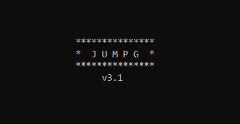
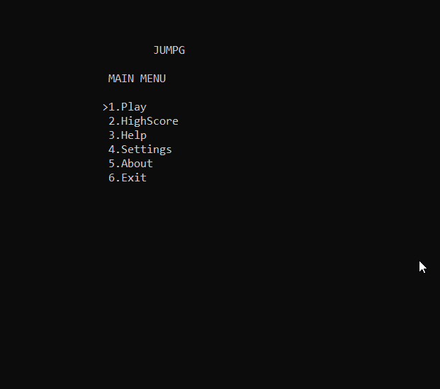

<h1 align="center">

JumpG
</h1>

<h5 align="center">The Jumping-Game</h5>

 

This is a console game for Windows OS.

Inspired from [Google's T-rex](chrome://dino/) game!

Have fun!!

 

## Download

* [JumpG_v3.1_lite](https://github.com/Siddhanta-10/JumpG/releases/tag/3.1.2)
* [JumpG_v3.1](https://github.com/Siddhanta-10/JumpG/releases/tag/3.1.1)

Note : If JumpG_v3.1_lite.exe does not work on your computer, then try JumpG_3.1.exe

 

## Gameplay

<h1 align="center"></img></h1>

 

1.Press SPACEBAR to jump and avoid obstacles

2.Press ESC to go back to main menu

 

## License

 

## Credits

* [Siddhanta Mandal](https://github.com/Siddhanta-10)
* [Karthikeshwar](https://github.com/Karthikeshwar1)

 
